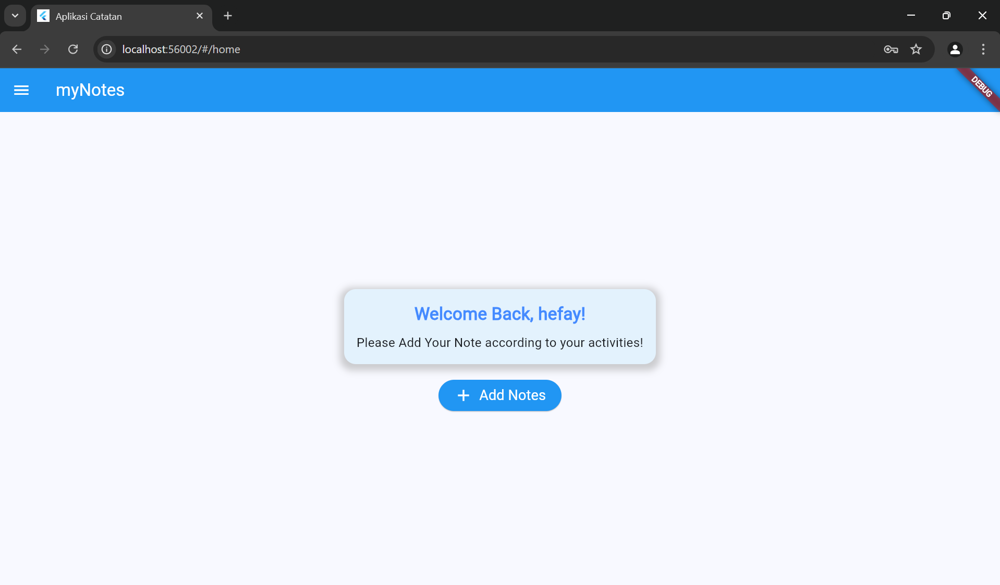

## Penjelasan Tugas 
main.dart: titik masuk utama aplikasi Flutter. Fungsi main() memanggil runApp() dengan instance dari MyApp, yang merupakan sebuah StatelessWidget. Di dalam MyApp, kita mengatur widget MaterialApp dengan judul, tema yang mengadopsi Material 3, dan sejumlah rute bernama yang mengarah ke berbagai halaman di dalam aplikasi. Rute awal ditentukan untuk halaman login, sehingga memberikan struktur yang jelas untuk navigasi di dalam aplikasi.

login_page.dart: `login_page` bertipe `StatefulWidget`, untuk mengelola input pengguna melalui `TextEditingController` untuk kolom username dan password. Fungsi `_saveUsername` memanfaatkan `SharedPreferences` untuk menyimpan username secara lokal ketika login berhasil. Metode `_login` akan memeriksa apakah kredensial yang dimasukkan sesuai dengan nilai yang telah ditentukan; jika sesuai, pengguna akan diarahkan ke halaman utama. Sebaliknya, jika login gagal, sebuah dialog peringatan akan ditampilkan. Antarmuka pengguna dirancang dengan field input yang menarik dan tombol login, semuanya dibungkus dalam kontainer terpusat untuk menciptakan tampilan yang rapi dan menarik.

 `home_page`, yang ditampilkan setelah pengguna berhasil login bertipe `StatefulWidget` yang memungkinkan pemuatan dan pengelolaan data dinamis, seperti username pengguna yang disimpan dengan menggunakan `SharedPreferences`.
Di dalam `initState`, fungsi `_loadUsername` dipanggil untuk mengambil username dari `SharedPreferences`. Jika username ditemukan, maka akan ditampilkan dalam pesan sambutan.
Antarmuka pengguna diatur dengan `AppBar` yang menampilkan judul aplikasi, dan konten utama menyambut pengguna dengan pesan yang mencakup username mereka. Di bagian bawah tampilan, terdapat tombol "Add Notes" Saat tombol ini ditekan diarahkan ke `note_page` menggunakan `Navigator.push`, sehingga pengguna dapat langsung mengakses halaman catatan untuk membuat catatan baru.

`Sidemenu` bertipe `StatelessWidget` yang menyajikan drawer navigasi untuk aplikasi. Ini terdiri dari ListView yang menampilkan beberapa ListTile, masing-masing mewakili rute yang berbeda, seperti halaman utama, halaman catatan, dan halaman tentang. Pengguna dapat mengklik salah satu item menu untuk berpindah ke halaman yang diinginkan. Desain yang sederhana namun fungsional memudahkan pengguna untuk menavigasi aplikasi.

 `AboutPage` bertipe`StatelessWidget`. halaman ini menggunakan `Scaffold` dengan `AppBar` berjudul "About" yang memiliki teks putih dan latar belakang biru. Konten utama berisi deskripsi aplikasi, fitur utama seperti kemampuan untuk menyimpan dan melihat catatan, serta informasi tentang pengembangnya, Hefay. Selain itu, terdapat menu samping (`Sidemenu`) yang memudahkan navigasi ke halaman lain dalam aplikasi. Hal ini membuat pengguna mendapatkan pemahaman yang jelas tentang tujuan dan fungsi aplikasi.

## ScreenShoot

